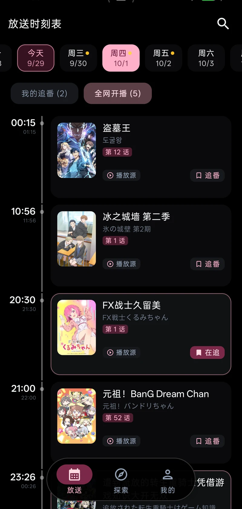
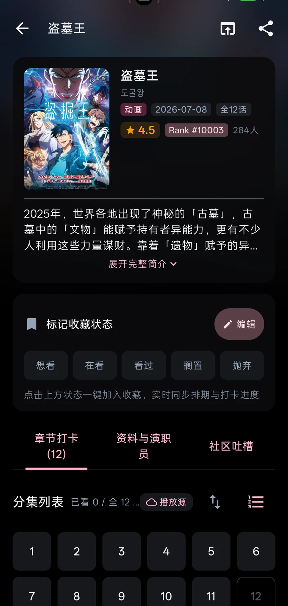
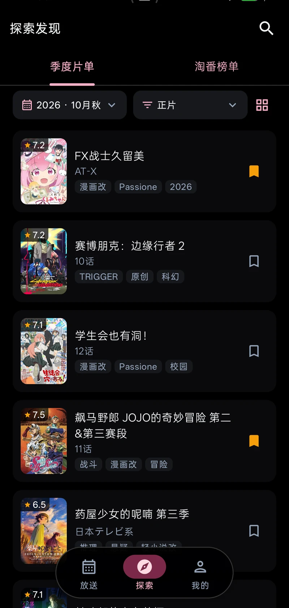
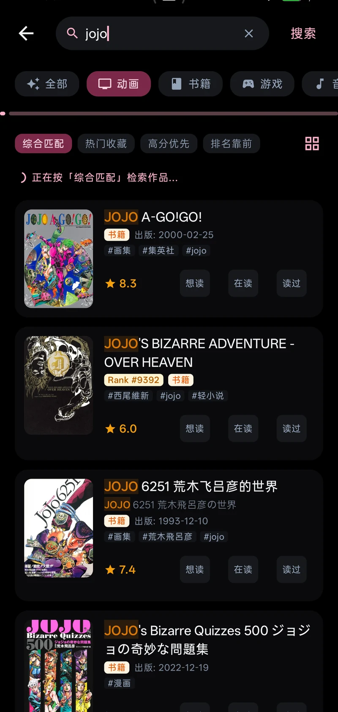

# MiniBgm

**现代化 Bangumi (bgm.tv) 番组计划 Android 客户端**

放送时间表 · 番剧详情 · 社区吐槽 · 收藏管理 · 搜索发现 · 开播提醒 · 桌面小组件

> 🚧 项目处于公开测试阶段，欢迎试用并反馈问题。当前最新版本见 **[Releases](https://github.com/infinitezerone/MiniBgm/releases/latest)**。

## 📸 截图

| 放送时间表 | 番剧详情 |
|---|---|
|  |  |
| **探索发现** | **搜索** |
|  |  |

## ✨ 功能特性

- 🔐 **账号登录与隐私直连** — 官方授权安全登录，密码不经第三方；内置 ECH 加密直连，数据仅存于设备硬件安全区
- 📅 **追番排期时间表** — 实时周历与时间轴视图，分集播出状态一目了然，正版播放源一键跳转
- 📺 **番剧详情与流转体验** — 完整资料、全维度评分排行、演职员列表；全屏 Material 3 平滑转场与自然高刷动效
- 📝 **极速打卡与收藏管理** — 观看进度实时同步，卡片支持一键就地打卡与误触撤销，追番管理轻松快捷
- 💬 **社区吐槽与讨论** — 原汁原味浏览并参与条目吐槽与讨论，图文排版自然流畅
- 🧭 **探索发现与导视** — 季度新番导视、热门淘番榜单，支持多维度筛选与列表/网格自由切换
- 🔍 **多维搜索** — 关键词检索、类型过滤及多重排序，快速找番
- ⏰ **准时开播提醒** — 每日追番概览与逐集开播前通知，好番准时不落空
- 📱 **桌面小组件与自适应** — 桌面看板一键直达，完美适配多种屏幕比例与沉浸式深浅色主题
- ☁️ **轻量低功耗后台同步** — 差量智能拉取，省电省流量，数据随时保持最新

## 📥 获取应用

前往 [Releases](https://github.com/infinitezerone/MiniBgm/releases/latest) 下载最新 APK，直接安装即可（需要 **Android 12 或更高版本**）。

应用内不会检查更新，想看新版本随时回这个页面看看。下载正式版 APK 覆盖安装会保留你的收藏和登录状态；自行构建的调试版与正式版签名不同，需要先卸载已装的版本才能安装。

## 📄 声明

本项目为个人学习用途的开源作品，仅使用 Bangumi 与 AniList 的公开 API；账号数据仅存于本机，使用本软件产生的任何问题由使用者自行承担。

## 🙏 致谢

- [Bangumi 番组计划](https://bgm.tv) 与其开放的 API
- [AniList](https://anilist.co) 提供的放送排期数据
- [bangumi-data](https://github.com/bangumi-data/bangumi-data) 提供的条目元数据与平台映射
- Google [*Now in Android*](https://github.com/android/nowinandroid) 的架构示范
