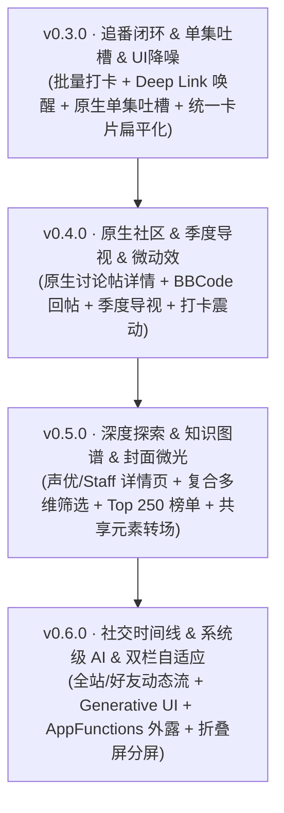

# MiniBgm 演进路线图 (Product & Technical Roadmap)

> **做最懂二次元、交互最流畅、视觉最精致的现代化 Bangumi 客户端**  
> 本路线图围绕二次元核心体验三大业务支柱——**追番 (Tracking)**、**找番 (Discovery)**、**社区 (Community)**，以及两大支撑底座——**UI/UX 现代美学系统** 与 **系统级现代智能化 (System Intelligence)** 制定，旨在系统性解决现有功能断层，打造标杆级移动端体验。  
> 💡 *针对当前已存在功能中反人类交互、逻辑卡点的专项整治方案，请参见独立跟踪文档：[🩺 体验排雷与交互治理计划 (UX_REMEDIATION.md)](UX_REMEDIATION.md)*。

---

## 🧭 总体架构与能力矩阵

```
                             ┌─── 1. 追番 (Tracking) ──── 极致顺滑的观影打卡闭环
                             │
                             ├─── 2. 找番 (Discovery) ─── 多维交叉筛选与知识图谱
                             │
MiniBgm 核心能力矩阵 ────────┼─── 3. 社区 (Community) ─── 原生单集吐槽与讨论交流
                             │
                             ├─── 4. 视觉 (Design System)  Content-First 美学与微动效
                             │
                             └─── 5. 智能 (Intelligence) ─ Generative UI 与系统级意图外露
```

---

## 1. 追番板块 (Tracking) —— 打造无缝观影打卡闭环

当前现状：依赖逐集手动点按打卡，播放源跳转为外链网页，缺乏季度大盘整理。

### 阶段目标与功能规划
- [x] **长按一键追到此集**：长按第 N 集弹出操作，一键将 1~N 集批量标为已看，带撤销（已落地，`markWatchedUpTo`）。
- [ ] **滑动进度条 / 快速打卡看板**：在条目页或首页支持手势滑动打卡；首页增加“最近在看”水平沉浸卡片，单手轻扫完成记录。
- [x] **播放源原生 Deep Link 直达** — 平台协议识别与原生客户端唤醒已落地（`StreamingIntentResolver` + `StreamingAppLauncher`），未安装时降级浏览器。
  - [x] 支持联动第三方本地/串流播放器（mpv / VLC，已落地；注意外部播放器无法携带 Referer 等自定义请求头，带头的直链不提供此入口）。
- [x] **Kazumi 风格一体化播放页 (Integrated Inline Player)** ⭐ *体验核心*
  - **页面架构**：告别纯全屏黑底孤岛，升级为标准的现代化流媒体播放页结构：
    - **顶部 (Top)**：16:9 原生视频播放视口（ExoPlayer 驱动，含播放控制遮罩、进度条、全屏旋转按钮）；
    - **中段 (Middle)**：**播放源切换栏 (Source Tabs)**（已导入的社区源、TVBox、自备片单无缝平铺 Tab，轻点即切源）+ 番剧简介与在看进度；
    - **下段 (Bottom)**：**分集选集网格 (Episode Grid)**（1~N 话分集方块，高亮当前播放集数，点击直截驱动顶部起播）；
    - **全屏模式**：点击全屏旋转横屏沉浸播放，呼出右侧抽屉式换集面板。
  - [x] **分集驱动的流直链嗅探与解析**：点击任意源与分集时，若不是直链则在后台自动请求目标分集页面嗅探提取真实视频流（.m3u8/.mp4），真正实现在应用内丝滑起播。
  - [x] **自备播放列表（JSON 导入）与 TVBox 兼容**：兼容社区标准与本地自备片单。
  - [x] **播完自动连播下一集**（已落地，可在选集面板开关）
  - [x] **断点续播与播放历史**：记录单集观看位置（按播放地址，DataStore 持久化、上限 50 条），再次进入时自动恢复并提示。
  - [x] **倍速控制**：1.0x / 1.25x / 1.5x / 2.0x（点击循环）。
  - [x] **失败可归因与快速切源**：某个源解析失败时行内提示原因，并引导一键切换至相邻源重试。
- [~] **季度新番导视大盘 (Seasonal Guide)** — 按季度网格总览与“剧场版 / OVA”归类已落地；唯“季初一键批量加想看”未做
  - 按季度（例如 2026 年冬、2026 年春）提供整季新番网格总览。
  - 自动归类：“新作首播”、“续作第二季”、“剧场版 / OVA”，支持季初一键批量将感兴趣的新番加入“想看 / 在看”。
- [ ] **系统级日历同步与开播倒计时**
  - **系统日历一键订阅**：将用户在追番剧的本周排期一键写入 Android 系统日历，开播前 15 分钟发出系统原生提醒。
  - **灵动胶囊 / Ongoing Notification**：在开播前后常驻轻量进度胶囊，开播后点击直接拉起播放源或打卡。

---

## 2. 找番板块 (Discovery) —— 从简单搜索到多维知识图谱

当前现状：仅支持单一关键词搜索与简易年份过滤，无法满足重度二次元用户的排雷、淘番与溯源需求。

### 阶段目标与功能规划
- [ ] **复合多维交叉过滤器 (Advanced Multi-Filter)**
  - 支持类似 AniList 的高自由度组合检索：
    - **类型维度**：TV / 剧场版 / OVA / Web
    - **时间维度**：年代区间（如 2010~2019）、具体季度
    - **制作机构**：按动画制作公司（MAPPA、京都动画、骨头社、CloverWorks 等）
    - **主创阵容**：监督 / 脚本家 / 系列构成 / 角色设计
    - **数据指标**：Bangumi 评分区间（如 7.5~10.0）、Rank 排名、收藏人数热度
    - **标签筛选**：支持多标签的交集（AND）与并集（OR），如 `原创 + 科幻 + 悬疑`。
- [ ] **声优与制作人员深度图谱 (Cast & Staff Universe)**
  - **声优详情页**：展示声优生平、历年配音角色列表（关联角色立绘与作品评分），点击角色可反向定位作品。
  - **制作人员履历轴**：点击监督/脚本（如新海诚、虚渊玄、冈田麿里），展示其职业生涯编年史与执导作品轨迹。
- [ ] **权威榜单与实时趋势**
  - **Bangumi Top 250 神作榜**：经典高分殿堂榜单。
  - **当季黑马榜**：评分高但标记人数较少的冷门佳作。
  - **争议话题榜**：评分方差极大（评价两极分化）的当季热度作品。
- [ ] **系列关联作品宇宙可视化**
  - 多季、前传、后传、剧场版、同名轻小说/漫画的时间线树状分支图，清晰展现观看顺序，彻底解决“入坑不知道先看哪部”的痛点。

---

## 3. 社区板块 (Community) —— 从跳外链到高黏性原生交流场

当前现状：社区功能极度初级，点击帖子直接跳转外部浏览器，严重缺失 Bangumi 灵魂级别的“单集吐槽”与“社交动态”。

### 阶段目标与功能规划
- [ ] **原生单集吐槽楼 (Episode Discussion Stream)** ⭐ *高优先级*
  - **每集独立讨论流**：看完一集打卡后，页面立即展示该集的专属吐槽。
  - **看番弹幕替代品**：用户可在单集下发表即时短评，支持标记是否包含剧透。
  - **智能防剧透机制 (Spoiler Protection)**：对于用户未看集数的相关短评与讨论，默认施加高斯模糊/折叠遮罩，必须手动点击确认才展开。
- [~] **原生讨论帖与富文本回帖 (Native Topics & Comments)** ⭐ *高优先级*
  - [x] **告别外部浏览器**：在 App 内使用 Jetpack Compose 实现原生帖子详情页与楼层列表。
  - [x] **BBCode 富文本渲染**：图文排版、表情贴图、引用回复、黑幕遮罩已支持（折叠块待补）。
  - [~] **原生回复与点赞**：**原生表态已落地（2026-09）**——讨论帖楼层与单集吐槽的表情 chip 均可点击 toggle（登录态 Bearer，`PUT/DELETE /p1/{groups|subjects}/-/posts/{id}/like` 与 `/p1/episodes/-/comments/{id}/like`，己方表态高亮）；**发表回帖/楼中楼被 p1 API 的 Cloudflare Turnstile 验证码阻塞**（`CreateReply` 强制 `turnstileToken`，第三方客户端无法干净获取），回帖动作暂维持跳浏览器出口，待官方放开后接入。
- [ ] **好友与全站动态时间线 (Timeline Feed)**
  - 增加“时间线”模块：
    - 好友追番动作（谁把某部番标为【看过】、打了多少分）；
    - 好友短评、长篇吐槽与推荐；
    - 收藏同步与二次元同好互动，形成良性社交网络闭环。

---

## 4. UI/UX 现代美学与交互系统 (Design System & Motion)

当前现状：部分卡片色彩过于突兀抢戏，容器比内容抢眼，缺少二次元海报张力与微动效反馈。

### 阶段目标与设计规范
- [x] **Content-First 设计哲学（内容第一，框架后退）**
  - **弱化大色块容器**：全站卡片统一转向 `surfaceContainerLow` 与微透明边框（`outlineVariant.copy(0.2f)`），消除视觉噪音。
- [x] **封面微光与沉浸海报（Ambient Glow）**：已落地（2026-09）——core/designsystem 纯 Kotlin 主色提取 + AmbientGlow 光晕组件，接入焦点卡片与条目详情页顶部。
- [ ] **标准化原子卡片体系 (Atomic Cards)**
  - **2:3 标准海报卡片**：新番网格、榜单、搜索结果严格遵循 2:3 黄金比例海报，角标浮动评分。
  - **紧凑型时间轴条目**：控制高度在 56~64dp，单行/双行极简排版，最大化单屏信息承载率。
  - **状态语义胶囊 (Status Pills)**：想看（柔紫）、在看（薄荷绿呼吸点）、看过（沉稳主色）、搁置（中性灰），全站视觉语义严格一致。
- [x] **微动效与触觉反馈 (Expressive Motion & Haptics)**
  - **打卡弹性动画与震动**：点击已看打卡触发 ScaleBounce 弹性形变与轻量震动反馈（HapticFeedback）。
  - **共享元素转场 (Shared Element Transition)**：列表封面点击平滑无缝缩放进入条目详情，杜绝白屏/黑屏割裂。
- [x] **深色模式与跨端自适应 (Adaptive & AMOLED)**
  - **深色双模**：提供“夜间护眼深灰”与“AMOLED 纯黑”双档切换。
  - **折叠屏与平板分屏**：大屏下自动切换双栏/三栏分屏（List-Detail），左侧选番/列表，右侧常驻详情与吐槽。

---

## 5. 现代系统级智能 (System & Generative AI)

当前现状：传统 Chatbot 对话框交互生硬，输出为纯文本 Markdown 表格，缺乏交互性。

### 阶段目标与功能规划
- [x] **AI 找源的边界：只转述工具结果，交付可播放数据** ⭐ *本期确立并已落地*
  - 目标产物是**能直接进播放器的结构化数据**：分集地址 + Referer 等请求头 + 集数列表，由助手会话渲染成可播放清单卡片，点击即跳 `PlayerRoute`。
  - 模型本身**不生成、不拼接、不改写任何地址**——地址只能来自 `findPlayableSources` 的返回，取数顺序固定为「用户自备片单 → 用户在播放源管理里配置的第三方取源接口（`kind = SOURCE` 的 URL 模板 + 可选固定请求头）→ 条目记录的来源页解析」。
  - 抓取受硬约束：只按用户配置的 URL 单页取一次，最多 5 页、正文 512 KB 上限，规则请求头只允许固定值（不含登录态，CR/LF/NUL 注入被拒）；不做站点遍历、不批量、不缓存结果，一律由用户在会话中显式触发。
  - 原"AI 智能嗅探播放源"入口按此收敛：条目页与放送页只把提问交接给助手会话（`AssistantRoute(prefillPrompt)`），智能体调用被架构红线限制在 `:feature:assistant` 内。
- [ ] **生成式交互组件 (Generative UI)**
  - AI 助手的返回结果彻底告别纯文本 Markdown 表格，由 Agent 组装并返回**原生的 Material 3 Compose 组件**（如带有真封面、Bangumi 分数徽章、一键打卡/跳转详情按钮的卡片流）。
- [ ] **接入 Android AppFunctions 规范**
  - 将核心能力（查询今日更新、搜索番剧、标记进度）注册为标准 Android AppFunctions 与 App Actions。
  - 支持手机系统智能体（如 ColorOS 小布助手、Google Gemini）直接语音免打开 App 调用。
- [ ] **跨应用意图识别与拖拽流转**
  - 适配 ColorOS 侧边栏/中转站、荣耀任意门：在 B 站或相册看到动漫截图，直接拖入 MiniBgm 侧边栏，通过视觉模型秒级识别番剧并弹出详情悬浮卡。

---

## 6. 播放源获取架构演进（2026-09 定稿）

> 找源能力按「确定性递减、成本递增」组织成瀑布。赢法是让“解析”发生得更少，而不是把某一层做得更强：维护成本外置到哪里（社区规则 / 服务端 addon / AI 现场推导），决定方案的生命力。

### 能力瀑布（上层命中即短路，下层不启动）

| 层 | 手段 | 确定性 | 状态 |
| :--- | :--- | :--- | :--- |
| 1 | 正版平台 Deep Link 直达（bangumi-data `sites` 映射已在本地，含官方 YouTube 频道 Muse Asia / Ani-One） | 确定性 | ✅ 已落地 |
| 2 | 用户自备片单 JSON（按集匹配直接直链起播） | 确定性 | ✅ 已落地 |
| 3 | 标准化源协议：`kind = SOURCE` 升级为流清单 schema（已落地）与 TVBox 社区源自动转换 | 确定性 | ✅ 已落地 |
| 4 | **分集驱动的流直链嗅探**：按具体分集自动请求页面，利用媒体正则抽取 `m3u8`/`mp4` 直链并在 Kazumi 播放页内原生起播 | 较高 | ✅ 已落地（2026-09） |
| 5 | 正则抽静态页（现状兜底抽取层） | 碰运气 | ✅ 已落地，债已清 |
| 6 | WebView 运行时捕获：无头 WebView + 网络请求拦截，**捕获日志即真值** | 较高 | ✅ 已落地（3a） |
| 7 | AI 现场推导：原语化 tool，勘探结果**经用户确认固化为用户自有规则** | 一次性成本 | 🔒 需决策记录 |

### 硬红线（对所有层生效）

- 播放地址的真值永远在网络层（捕获日志 / 接口返回）；模型转述的、页面文本中出现的地址一律不采信；
- 模型只调用受控原语（load / readDom / querySelector / listRequests），不生成 URL、不生成可执行代码；
- WebView 会话隔离：独立 Cookie profile（无登录态）、无 JS bridge、单会话、用户显式触发；
- 目录属社区、机制属 App：站名是短命数据，App 不内置任何站点清单。

### 分期

1. **还债**（不动边界）— **已完成（2026-09）**：512 KB 流式截断（`PageFetchServiceImpl` 流式读取，读满即停）；`FetchedPage.url` 返回重定向终点修正 Referer；分集标注真实抽取（URL 带 ep/E 前缀的数字为强信号无条件采用，裸数字仅整季请求时采用，分辨率/编码/年份过滤）；AI 找源卡片接入 `PlaybackFailureStore`（行内标"打不开"与原因）；B 站搜索页抓取兜底**已移除**（仅指 AI 找源链路里的页面抓取——播放站点的流地址由 JS 向签名接口请求，静态页正则必然抽空；B 站作为 Deep Link 与外跳搜索目标的能力原样保留）。
2. **播放器壳补齐** — **已完成（2026-09）**：播完连播、断点续播（与打卡完全独立）、全屏选集抽屉、倍速。
3. **源协议化 — 已完成（2026-09，addon client 暂缓）**：
   - ✅ **流清单 schema（2026-09 落地）**。决策记录：问题——`kind = SOURCE` 响应此前只能靠全局正则抽直链，结构化接口无法表达分集标注与条目级请求头；被否决的先例——yt-dlp 服务端（已判不做）、纯正则（现状，表达力不足）；方案——解析层新增流清单识别 `{"streams":[{"url","title","headers"}]}`（Stremio `/stream` 响应兼容形态），仅作用于用户配置的 SOURCE 接口的单次请求，无 `streams` 字段回退正则、空数组视为明确无结果、条目上限 50；无持久化、无新增网络行为；验证——`PlaybackResolverRepositoryTest` 清单映射/头合并/回退/空清单/非法 url 用例。`:core:data` 依 `:core:model`/`:core:network` 先例补应用 `kotlin.serialization` 插件。
   - ⏸ **Stremio addon client + ID 映射**：暂缓（2026-09 定）。它把"用户手写 SOURCE 规则指向 addon /stream 地址"自动化，前提是需要 fribb/anime-lists 映射表（数 MB，AniList ID → IMDb ID）及获取方案取舍；在确认要消费 Stremio addon 生态之前不做。流清单 schema 已为此预留好协议地基。
4. **自愈档**：
   - ✅ **3a · WebView 抓包（2026-09 落地）**。决策记录：问题——正则档对 JS 渲染站点结构性无解；被否决先例——模型生成可执行 JS（会摧毁"真值在网络层"：注入脚本可伪造捕获请求，且模型输入含不可信页面文本，存在提示注入链）、yt-dlp（已判不做）；方案——新增 `:core:webview`（Android-only）承载无头 WebView 捕获会话，`:core:ai` 工具链不变，入口为助手会话内用户显式触发的"深度解析"按钮（仅当找源工具报告无结果时出现）；红线——真值只认网络捕获、模型仅受控原语（3b 再议）、沙箱（会话清空 Cookie/无 JS bridge/禁文件与内容访问/单会话）、单页 30s 预算、结果不缓存、失败进失败归因；验证——候选页选择/命中即停/降级与助手状态机用单测覆盖，真实 WebView 拦截行为仅真机验证（结构性让步，已记录）。
   - 🔒 **3b · AI 现场推导与规则固化**：待决策——固化产物的形态（WebView 原语序列 or 降级为 SOURCE URL 模板）与存储位置；3a 的协议地基已预留。
5. **可选扩展**：BT 边下边播（libtorrent4j + 本地 HTTP Range 服务 + Media3 本地 URL，swarm 健康度接入失败归因做“无做种”预判）；需独立决策。
6. **站点知识退场 — 首轮已完成（2026-09-22）**：唯一的内置站点定制嗅探（针对某一站的 `data-apireq` 三步流程）已从 `:core:data` 删除，同时清掉 AI 提示词、界面文案与各模块测试里的真实站点名/域名（全仓库生产代码残留 0）。
   - **顺序未颠倒**：删代码前先用新增用例验证了等价能力——`FETCH` 分页 → `EXTRACT_VARIABLE` 抽参（引擎自动 URL 解码）→ `FETCH POST` 带 `captureHeaders` 取 cookie → `EXTRACT_STREAM` 抽流，全链跑通才动刀。规避的正是"用户能力先回落"。
   - **行为变化**：该站从"内置自动嗅探"变为"用户配一次规则"，助手可用 `proposePlaybackRule` 现场生成。
   - 调研文档 §五 收口情况：试解析断言门**已随提案门落地**（`PlaybackSourceVerifier` 首包 2xx/206 + Content-Type 断言，断言不过不出提案）；WebView 嗅探判定表**已落地（见第 8 条）**；规则健康度**已落地**（`PlaybackFailureStore.sourceHealth` 按源累计连续失败、成功即清零，`PlayerViewModel` 订阅后经 `sourceFailureCounts` 流到选源界面 `SourceFailureHint` 弱化标记——只标记不重排，`selectedSourceIndex` 有位置语义）；调研文档 §五 全部收口（2026-09-23 审计）。
8. **WebView 嗅探判定表 — 已完成（2026-09-23）**。决策记录：问题——捕获层只靠媒体后缀正则判定，漏掉"直链无后缀、靠 Range 头拉流"的 JS 站形态，且 `.ts` 分片会按到达序挤占候选上限、把真正的播放清单挤出前 12；方案——`:core:webview` 新增纯函数判定表 `MediaCandidateJudge`（不碰回调线程以外的任何东西）：后缀强信号直采；`Range: bytes=` + 非静态资源 + 非广告统计域名推断为媒体（Kazumi 式启发式）；候选按 rank 排序后再截断（清单 > 直连视频 > Range 推断 > 分片沉底）；被否决的先例——拦截响应体做类型/首包体积判定（需缓冲响应，破坏透传纪律、成本高）；边界——判定表只做了请求侧的确定性信号，"存活时长"未做（依赖长连接观察）；验证——`:core:webview` 新增 testDebugUnitTest 源集 + 6 用例全绿，`shouldInterceptRequest` 行为仅真机验证的结构性让步不变。
7. **列表语义 — 已完成（2026-09-23）**。决策记录：问题——`EXTRACT_STREAM` 只取正则首个匹配，规则实质是"单集快照"，AI 现场推导的规则无法覆盖整季（这是 §6 第 7 层"运行一次固化成站点规则"的阻塞项，即调研文档 §五.1）；被否决的先例——新增步骤类型或脚本引擎（schema 膨胀、滑向造语言）；方案——**不扩 schema**：`EXTRACT_STREAM` 正则第 1 组捕获直链、可选第 2 组捕获集名文本，`findAll` 收集全部候选（上限 50，`distinctBy` 去重），"按话数选条目"成为引擎固定行为——集名标注优先、其次地址强信号（整季请求才放开弱信号）、全对不上退回首候选以兼容旧的锚定 `{ep}` 规则，整季请求（ep=0）返回完整候选列表并带真实集号；配套新增 `episodeNumberFromLabel`（第N集/话、[N]、EP、纯数字，与 `entryMatchesEpisode` 判定形态对齐）并把列表语义写进录制器 notes、助手 prompt 与工具描述（禁止把 `{ep}` 锚死在正则）；验证——`:core:data` 引擎测试 +4（标注选中/整季列表/旧形态兜底/标注解析），spotlessCheck + 架构红线 + `:app:assembleDebug` 全绿。
9. **首轮实测（P1）与弱信号修复 — 已完成（2026-09-23）**。方法——复刻引擎口径抓真实站点样本（KazumiRules 17 站基线中 3 个代表站：静态直链站 dcc3.com、MacCMS 模板站 gugu3.com / moonci.com），用真实 `PlaybackRuleEngine` + 真实页面 fixture 做回放 harness（临时测试，跑完即删，发现固化成永久回归用例）。**实测发现并修复 1 个真 bug**：`episodeNumberFromUrl` 弱信号按"最后一个数字 token"抽取，把 m3u8 地址哈希段 `ac4395ad` 里的 `4395` 标成集号（"第 4395 话"）——修复为裸数字仅在独占一段路径（两侧为分隔符/端点）时采用，与"裸数字仅整季请求时采用"的既有措辞对齐；该函数此前无任何直接单测。**实测结论（3b/健康度决策输入）**：(a) 每集页嵌各自直链、且直链分布在**不同 CDN 域名**（每集域名都不同）——旧"锚定 {ep} 于 URL 正则"形态必死，`{ep}` 逐集页模板 + 整页抽取是唯一成立的静态形态，ep1/2/3 全部命中各自直链；(b) 固定页快照规则请求别集时回退路径会返回错集直链并标注成请求集号（"内容与标注错位"），这是健康度/校验要拦的形态；(c) MacCMS `provide/vod` 接口两站均返回字面 `closed`（协议层在这批站不可用，印证 2026-09-23 记录）；(d) gugu3 播放页 `player_aaaa.url` 为 yunjie 播放器不透明 ID（真流由 JS 运行时解析）——导航层全静态、最后一跳结构性需 WebView，与 17/17 useWebview=true 基线一致；`episodeNumberFromUrl` 此前无直接单测是 bug 存活的根因，已补齐。
10. **规则版本门控 — 已完成（2026-09-23）**。决策记录：问题——今天已连续多次修改规则**语义**（列表语义第 1/2 组约定、判定表 rank 排序）而 schema 无版本概念，未来任何语义演进（或 3b 决定的新形态）都会让旧客户端静默按错误语义执行新规则；被否决的先例——把版本校验并进 `isResolvable`（该属性语义是"解析器组合有执行路径"，混合版本语义会让既有的组合校验报错口径失真）；方案——`PlaybackRuleApi` 协议常量（`WRITER_RULE_VERSION=1` 写入方打标 / `SUPPORTED_RULE_API=1` 客户端能力级别）+ 规则新增 `ruleVersion`/`minClientApi` 字段（默认值保证旧 JSON 反序列化兼容）+ 新属性 `isImportable = isResolvable && minClientApi ≤ SUPPORTED_RULE_API`；接线三处——AI 提案校验（`testPlaybackRule`/`proposePlaybackRule`，拒绝原因可诊断）、手动批量导入（partition）、执行侧防线（`resolveRule` 开头拦截，防备份恢复等绕过导入校验的入库路径）；验证——model 测试 +2（导入判定组合 / 旧 JSON 缺省字段兼容）、core:data 测试 +1（执行门拒收且零网络请求），全绿。**首次消费 `ruleVersion` 的语义演进发生时才递增版本号**——当前所有语义变更均向后兼容，版本恒为 1。

---

## 🧭 边界与暂缓的方向

以下选项经讨论后**主动排除或押后**，记录理由以免被反复重新提出：

- **内置各站解析器 / 远程规则订阅包** — 不做。站点改版即失效，需要长期跟改与专人运维，而每次修复都要走一次发版；对单人维护的项目，收益不足以覆盖这条持续成本。播放来源统一收敛到“用户自备列表”。
- **yt-dlp 集成 — 不做**（2026-09 定）。本地打包 Python 引擎要付出 +100 MB 体积与秒级冷启动，且 extractor 修复被绑死在 App 发版节奏上，恰恰丢掉 yt-dlp “上游当天修复、用户零动作”的命脉；不自架服务端则其价值无从兑现。同等需求由第 6 节能力瀑布的第 3 层（源协议化）与第 5/6 层（WebView 捕获 + AI 自愈）覆盖。
- **弹幕接入** — 押后，且要重新界定范围。它是一套全新的第三方 API + 渲染层与逐帧性能投入；更关键的是第三方弹幕库的条目/分集匹配是**启发式**的，与本项目"只认已验证播出事件、不做算术猜测"的数据准则直接冲突。若将来实现，低置信度匹配必须**不显示**，而不是默认显示后由用户纠错。
- ~~**AI 直接取流** — 只到页面链接为止~~（本期撤销该限制：改为第 5 节的"地址只能由工具解析返回、模型不得生成"）
- **全屏播放手势** — 押后（理由见第 1 节）。

---

## 📅 版本里程碑规划 (Milestones)



| 里程碑版本 | 核心主题 | 关键交付内容 |
| :--- | :--- | :--- |
| **v0.3.0** | **追番闭环 & 单集吐槽 & UI降噪** | 1. 单集长按“看到此集”批量打卡<br>2. 播放源 Deep Link 原生唤醒官方客户端<br>3. 原生单集独立吐槽楼与剧透遮罩<br>4. 全局卡片视觉降噪（弱化大色块容器，统一间距） |
| **v0.4.0** | **原生讨论区 & 季度导视 & 微动效** | 1. 原生帖子详情页与楼中楼回复（彻底告别跳浏览器）<br>2. 季度新番导视总览大盘<br>3. 开播日历系统写入与提醒<br>4. 打卡弹性动效与轻触感震动反馈 |
| **v0.5.0** | **高维探索 & 知识图谱 & 沉浸海报** | 1. 监督/声优/制作人员图谱详情页<br>2. 高级多维复合过滤器<br>3. Top 250 与冷门佳作官方榜单<br>4. 封面自适应微光（Ambient Glow）与共享元素平滑展开 |
| **v0.6.0** | **动态时间线 & 现代系统级 AI & 跨端** | 1. 好友与全站看番动态时间线 (Timeline)<br>2. AI 助手 Generative UI 原生卡片返回<br>3. 接入 Android AppFunctions 供系统级语音调用<br>4. 折叠屏/平板双栏分屏（List-Detail）自适应场景 |
