# `:app`

## 🎯 模块职责
全应用的主入口与装配宿主，负责聚合所有 `:feature:*` 业务模块与 `:core:*` 基础设施模块，初始化全局依赖注入（Koin），并作为顶层 Activity 承载全局导航调度。

## 🏛️ 依赖关系
* **依赖的上游**：所有 `:core:*` 模块、所有 `:feature:*` 模块
* **被谁依赖**：无（顶层入口模块）

## ⚠️ 架构红线与约束
1. 不承载具体的业务逻辑与领域操作，业务逻辑一律下沉到对应 `:feature:*` 或 `:core:data`。
2. 仅作为路由调度、窗口环境配置与全局 DI 装配中心。

## Module dependency graph

```mermaid
---
config:
  layout: elk
  elk:
    nodePlacementStrategy: SIMPLE
---
graph TB
  subgraph :sync
    direction TB
    :sync:work[work]:::android-library
  end
  subgraph :feature
    direction TB
    :feature:assistant[assistant]:::android-feature
    :feature:schedule[schedule]:::android-feature
    :feature:search[search]:::android-feature
    :feature:subject[subject]:::android-feature
    :feature:user[user]:::android-feature
    :feature:widget[widget]:::android-feature
  end
  subgraph :core
    direction TB
    :core:ai[ai]:::kmp-library
    :core:common[common]:::kmp-library
    :core:data[data]:::kmp-library
    :core:database[database]:::kmp-library
    :core:datastore[datastore]:::kmp-library
    :core:designsystem[designsystem]:::android-library
    :core:model[model]:::kmp-library
    :core:navigation[navigation]:::android-library
    :core:network[network]:::kmp-library
    :core:webview[webview]:::android-library
  end
  :app[app]:::android-application

  :app -.-> :core:ai
  :app -.-> :core:common
  :app -.-> :core:data
  :app -.-> :core:database
  :app -.-> :core:datastore
  :app -.-> :core:designsystem
  :app -.-> :core:model
  :app -.-> :core:navigation
  :app -.-> :core:network
  :app -.-> :core:webview
  :app -.-> :feature:assistant
  :app -.-> :feature:schedule
  :app -.-> :feature:search
  :app -.-> :feature:subject
  :app -.-> :feature:user
  :app -.-> :feature:widget
  :app -.-> :sync:work
  :core:ai -.->|commonMainImplementation| :core:common
  :core:ai -.->|commonMainImplementation| :core:data
  :core:ai -.->|commonMainImplementation| :core:model
  :core:data -.->|commonMainImplementation| :core:common
  :core:data -.->|commonMainImplementation| :core:database
  :core:data -.->|commonMainImplementation| :core:datastore
  :core:data -.->|commonMainImplementation| :core:model
  :core:data -.->|commonMainImplementation| :core:network
  :core:database -.->|commonMainImplementation| :core:common
  :core:database -.->|commonMainImplementation| :core:model
  :core:datastore -.->|commonMainImplementation| :core:common
  :core:datastore -.->|commonMainImplementation| :core:model
  :core:designsystem -.-> :core:common
  :core:navigation -.-> :core:common
  :core:network -.->|commonMainImplementation| :core:common
  :core:network -.->|commonMainImplementation| :core:model
  :core:webview -.-> :core:common
  :core:webview -.-> :core:data
  :core:webview -.-> :core:model
  :feature:assistant -.-> :core:ai
  :feature:assistant -.-> :core:common
  :feature:assistant -.-> :core:data
  :feature:assistant -.-> :core:designsystem
  :feature:assistant -.-> :core:model
  :feature:assistant -.-> :core:navigation
  :feature:schedule -.-> :core:common
  :feature:schedule -.-> :core:data
  :feature:schedule -.-> :core:designsystem
  :feature:schedule -.-> :core:model
  :feature:schedule -.-> :core:navigation
  :feature:search -.-> :core:common
  :feature:search -.-> :core:data
  :feature:search -.-> :core:designsystem
  :feature:search -.-> :core:model
  :feature:search -.-> :core:navigation
  :feature:subject -.-> :core:common
  :feature:subject -.-> :core:data
  :feature:subject -.-> :core:designsystem
  :feature:subject -.-> :core:model
  :feature:subject -.-> :core:navigation
  :feature:user -.-> :core:common
  :feature:user -.-> :core:data
  :feature:user -.-> :core:designsystem
  :feature:user -.-> :core:model
  :feature:user -.-> :core:navigation
  :feature:widget -.-> :core:common
  :feature:widget -.-> :core:data
  :feature:widget -.-> :core:designsystem
  :feature:widget -.-> :core:model
  :feature:widget -.-> :core:navigation
  :sync:work -.-> :core:common
  :sync:work -.-> :core:data
  :sync:work -.-> :core:datastore
  :sync:work -.-> :core:model
  :sync:work -.-> :core:navigation

classDef android-application fill:#CAFFBF,stroke:#000,stroke-width:2px,color:#000;
classDef android-feature fill:#FFD6A5,stroke:#000,stroke-width:2px,color:#000;
classDef kmp-library fill:#9BF6FF,stroke:#000,stroke-width:2px,color:#000;
classDef android-library fill:#BDB2FF,stroke:#000,stroke-width:2px,color:#000;
classDef unknown fill:#FFADAD,stroke:#000,stroke-width:2px,color:#000;
```

<!--region graph-->


<details><summary>📋 Graph legend</summary>

```mermaid
graph TB
  application[application]:::android-application
  feature[feature]:::android-feature
  kmp library[kmp library]:::kmp-library
  android library[android library]:::android-library

  application -.-> feature
  library --> kmp library

classDef android-application fill:#CAFFBF,stroke:#000,stroke-width:2px,color:#000;
classDef android-feature fill:#FFD6A5,stroke:#000,stroke-width:2px,color:#000;
classDef kmp-library fill:#9BF6FF,stroke:#000,stroke-width:2px,color:#000;
classDef android-library fill:#BDB2FF,stroke:#000,stroke-width:2px,color:#000;
classDef unknown fill:#FFADAD,stroke:#000,stroke-width:2px,color:#000;
```

</details>
<!--endregion-->
