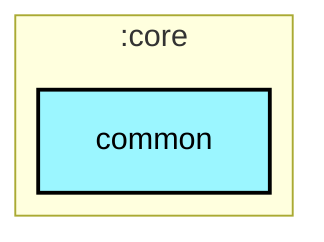

# `:core:common`

## 🎯 模块职责
通用工具与基础抽象层，提供全工程通用的协程调度器注入模型（`BgmDispatchers`）、结果封装（`AppResult<T>`）及通用工具类。

## 🏛️ 依赖关系
* **依赖的上游**：无（仅依赖通用 Kotlin 库）
* **被谁依赖**：`:core:network`, `:core:database`, `:core:datastore`, `:core:data`, 所有 `:feature:*`, `:app`

## ⚠️ 架构红线与约束
1. 仅包含纯 Kotlin 通用工具与无状态辅助函数，严禁包含特定业务领域逻辑或 UI 表现逻辑。

## Module dependency graph

<!--region graph-->


<details><summary>📋 Graph legend</summary>

```mermaid
graph TB
  application[application]:::android-application
  feature[feature]:::android-feature
  kmp library[kmp library]:::kmp-library
  android library[android library]:::android-library

  application -.-> feature
  library --> kmp library

classDef android-application fill:#CAFFBF,stroke:#000,stroke-width:2px,color:#000;
classDef android-feature fill:#FFD6A5,stroke:#000,stroke-width:2px,color:#000;
classDef kmp-library fill:#9BF6FF,stroke:#000,stroke-width:2px,color:#000;
classDef android-library fill:#BDB2FF,stroke:#000,stroke-width:2px,color:#000;
classDef unknown fill:#FFADAD,stroke:#000,stroke-width:2px,color:#000;
```

</details>
<!--endregion-->
