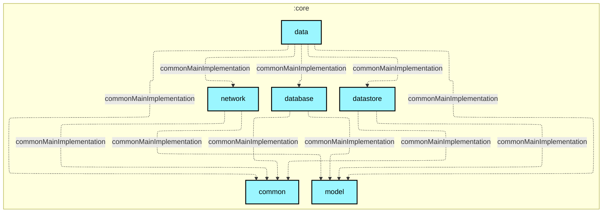

# `:core:data`

## 🎯 模块职责
全应用的单一可信源（Single Source of Truth, SSOT）数据仓库层。协调网络远程数据（`:core:network`）、本地缓存（`:core:database`）与配置凭据（`:core:datastore`），向上游 Feature 模块与 ViewModel 提供干净的响应式数据流与业务操作封装。

## 🏛️ 依赖关系
* **依赖的上游**：`:core:model`, `:core:common`, `:core:network`, `:core:database`, `:core:datastore`
* **被谁依赖**：所有 `:feature:*` 模块, `:app`
* **禁止依赖**：禁止依赖任何 `:feature:*` 模块或 UI/Compose 框架。

## ⚠️ 架构红线与约束
1. 作为唯一的领域数据门面（SSOT），所有对网络或数据库的读写必须收口于本层的 Repository。
2. Repository 方法对外统一暴露 `Flow<T>` 响应式流或包装在 `AppResult<T>` 中的挂起函数。
3. **排期与放送事件真值原则（Air Schedule SSOT）**：
   - 时刻表单集事件（`AirEventEntity`）严格由真实排期源（日番走 AniList，国创/B站独播走 Bilibili）驱动；
   - 彻底废除机械算术推算，不伪造任何虚拟预测事件；
   - `bangumi-data` 仅作为关系映射（跨站 ID 转换与播放源跳转）与译名补充，禁止用其 `begin` 或 `broadcast` 反向污染官方放送时刻。

## Module dependency graph

<!--region graph-->


<details><summary>📋 Graph legend</summary>

```mermaid
graph TB
  application[application]:::android-application
  feature[feature]:::android-feature
  kmp library[kmp library]:::kmp-library
  android library[android library]:::android-library

  application -.-> feature
  library --> kmp library

classDef android-application fill:#CAFFBF,stroke:#000,stroke-width:2px,color:#000;
classDef android-feature fill:#FFD6A5,stroke:#000,stroke-width:2px,color:#000;
classDef kmp-library fill:#9BF6FF,stroke:#000,stroke-width:2px,color:#000;
classDef android-library fill:#BDB2FF,stroke:#000,stroke-width:2px,color:#000;
classDef unknown fill:#FFADAD,stroke:#000,stroke-width:2px,color:#000;
```

</details>
<!--endregion-->
