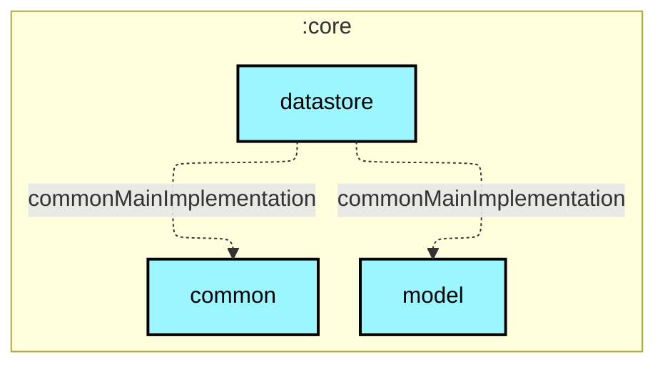

# `:core:datastore`

## 🎯 模块职责
负责用户配置偏好（`UserPreferences`）与敏感凭据（OAuth Token）的本地持久化。普通偏好走 Proto DataStore，Token 经 AndroidKeyStore AES-256-GCM 硬件加密独立落盘。

## 🏛️ 依赖关系
* **依赖的上游**：`:core:model`, `:core:common`, `:core:network`（仅依赖 `TokenProvider` 接口）
* **被谁依赖**：`:core:data`, `:app`
* **禁止依赖**：禁止依赖 `:core:database` 或任何 `:feature:*` 模块。

## ⚠️ 架构红线与约束
1. OAuth Token 与普通偏好必须物理隔离存储；Token 文件必须配置备份排除规则（`dataExtractionRules` / `fullBackupContent`）。
2. 普通偏好文件严禁记录任何明文 Token。

## Module dependency graph

<!--region graph-->


<details><summary>📋 Graph legend</summary>

```mermaid
graph TB
  application[application]:::android-application
  feature[feature]:::android-feature
  kmp library[kmp library]:::kmp-library
  android library[android library]:::android-library

  application -.-> feature
  library --> kmp library

classDef android-application fill:#CAFFBF,stroke:#000,stroke-width:2px,color:#000;
classDef android-feature fill:#FFD6A5,stroke:#000,stroke-width:2px,color:#000;
classDef kmp-library fill:#9BF6FF,stroke:#000,stroke-width:2px,color:#000;
classDef android-library fill:#BDB2FF,stroke:#000,stroke-width:2px,color:#000;
classDef unknown fill:#FFADAD,stroke:#000,stroke-width:2px,color:#000;
```

</details>
<!--endregion-->
