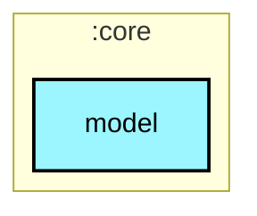

# `:core:model`

## 🎯 模块职责
领域核心数据模型层，定义全应用通用的业务实体（如 Subject、Episode、AirSchedule、UserProfile 等）与纯 Kotlin 数据结构。

## 🏛️ 依赖关系
* **依赖的上游**：无（底层根模块）
* **被谁依赖**：`:core:common`, `:core:network`, `:core:database`, `:core:datastore`, `:core:data`, `:core:designsystem`, 所有 `:feature:*`, `:app`

## ⚠️ 架构红线与约束
1. 保持纯 Kotlin（0 外部系统依赖），严禁引入任何 `android.*`、Ktor、Room 或 Compose/UI 相关依赖。

## Module dependency graph

<!--region graph-->


<details><summary>📋 Graph legend</summary>

```mermaid
graph TB
  application[application]:::android-application
  feature[feature]:::android-feature
  kmp library[kmp library]:::kmp-library
  android library[android library]:::android-library

  application -.-> feature
  library --> kmp library

classDef android-application fill:#CAFFBF,stroke:#000,stroke-width:2px,color:#000;
classDef android-feature fill:#FFD6A5,stroke:#000,stroke-width:2px,color:#000;
classDef kmp-library fill:#9BF6FF,stroke:#000,stroke-width:2px,color:#000;
classDef android-library fill:#BDB2FF,stroke:#000,stroke-width:2px,color:#000;
classDef unknown fill:#FFADAD,stroke:#000,stroke-width:2px,color:#000;
```

</details>
<!--endregion-->
