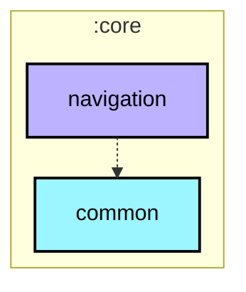

# :core:navigation

## Scope & Responsibilities
- Centralizes Navigation 3 runtime contracts, route declarations (`NavKey`), and state management.
- Exposes `BgmNavState` (`rememberBgmNavState`) for multi-backstack orchestration, state restoration, and exit-through-home semantics.
- Exposes `TopLevelDestination` enums for top-level navigation bars, rails, and drawers.

## Dependency Topology
- **Depends on**: Jetpack Navigation 3 runtime/ui, Jetpack Compose Material 3, `kotlinx.serialization`.
- **Depended on by**: `:app`, all `:feature:*` modules, and optional presentation libraries.
- **Does NOT depend on**: `:app` or any `:feature:*` modules.

## Invariants & Redlines
1. Must not import or reference any concrete feature screens or ViewModels.
2. All route classes/objects must implement `androidx.navigation3.runtime.NavKey` and be `@Serializable`.
3. Navigation state management must support process death survival via `rememberSaveable`.

## Module dependency graph

<!--region graph-->


<details><summary>📋 Graph legend</summary>

```mermaid
graph TB
  application[application]:::android-application
  feature[feature]:::android-feature
  kmp library[kmp library]:::kmp-library
  android library[android library]:::android-library

  application -.-> feature
  library --> kmp library

classDef android-application fill:#CAFFBF,stroke:#000,stroke-width:2px,color:#000;
classDef android-feature fill:#FFD6A5,stroke:#000,stroke-width:2px,color:#000;
classDef kmp-library fill:#9BF6FF,stroke:#000,stroke-width:2px,color:#000;
classDef android-library fill:#BDB2FF,stroke:#000,stroke-width:2px,color:#000;
classDef unknown fill:#FFADAD,stroke:#000,stroke-width:2px,color:#000;
```

</details>
<!--endregion-->
