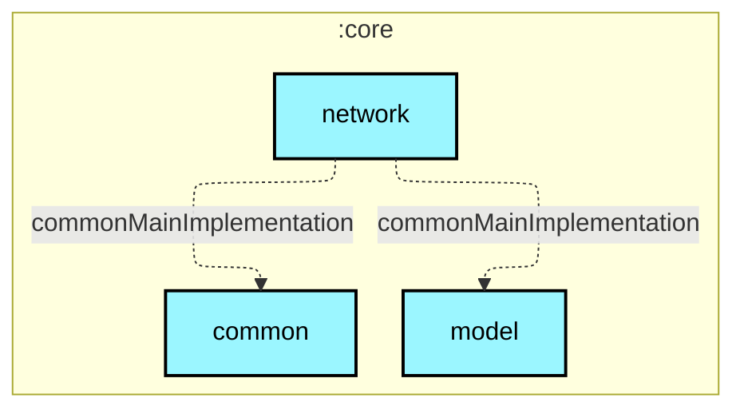

# `:core:network`

## 🎯 模块职责
负责应用与外部网络的通信交互，包括：
1. Bangumi REST v0 API 调用；
2. bangumi-data CDN 数据抓取（作为跨平台关系与播放链接字典）；
3. AniList GraphQL 逐话真实播出时刻查询 (`AniListService`)；
4. Bilibili Web API 逐话真实 `pub_time` 查询 (`BilibiliService`)；
5. 经 Cloudflare Worker 代理的 OAuth Token 交换与刷新。

## 🏛️ 依赖关系
* **依赖的上游**：`:core:model`, `:core:common`
* **被谁依赖**：`:core:data`, `:core:datastore`, `:app`
* **禁止依赖**：禁止依赖 `:core:database` 或任何 `:feature:*` 模块。

## ⚠️ 架构红线与约束
1. 所有对外部网络请求必须通过本模块统一构建的 Client 发出，确保合规注入 `User-Agent` 与超时/错误重试策略。
2. 业务 API 方法严禁暴露或接收 accessToken，所有鉴权均由底层 Auth 拦截器自动注入与透明刷新。
3. 网络层仅负责协议通信与 DTO 序列化，不包含任何跨数据源聚合或排期仲裁逻辑（仲裁统一收口于 `:core:data`）。

## Module dependency graph

<!--region graph-->


<details><summary>📋 Graph legend</summary>

```mermaid
graph TB
  application[application]:::android-application
  feature[feature]:::android-feature
  kmp library[kmp library]:::kmp-library
  android library[android library]:::android-library

  application -.-> feature
  library --> kmp library

classDef android-application fill:#CAFFBF,stroke:#000,stroke-width:2px,color:#000;
classDef android-feature fill:#FFD6A5,stroke:#000,stroke-width:2px,color:#000;
classDef kmp-library fill:#9BF6FF,stroke:#000,stroke-width:2px,color:#000;
classDef android-library fill:#BDB2FF,stroke:#000,stroke-width:2px,color:#000;
classDef unknown fill:#FFADAD,stroke:#000,stroke-width:2px,color:#000;
```

</details>
<!--endregion-->
