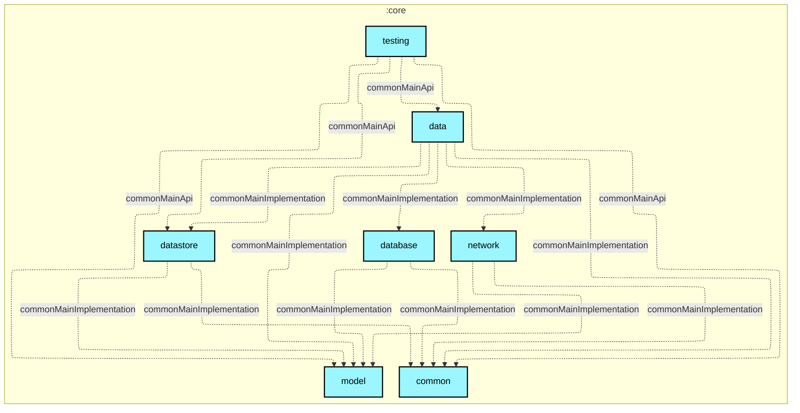

# `:core:testing`

## 🎯 模块职责
全工程共享的测试基础设施与测试套件支持模块。为 Feature 模块、ViewModel 与数据层单元测试提供标准的纯内存测试替身（Fake Repositories）、协程主线程调度规则（`MainDispatcherRule`）以及预置测试数据（`TestData`）。

## 🏛️ 依赖关系
* **依赖的上游**：`:core:model`, `:core:common`, `:core:data`
* **被谁依赖**：所有 `:feature:*` 模块（经 `minibgm.android.feature` 约定插件自动引入 `testImplementation`）、`:app` 及其他模块的测试源集
* **禁止依赖**：禁止依赖 `:core:network` 或 `:core:database` 的内部实现，禁止作为生产代码（`main` / `commonMain` 业务实现）的运行期依赖。

## ⚠️ 架构红线与约束
1. 本模块仅供测试（Test Sourcesets）消费，严禁被任何业务模块以 `implementation` 引入到最终 APK 构建中。
2. 内部所有的 Fake 仓库必须保持纯内存状态（In-Memory），禁止引入真实网络 IO 或持久化磁盘 IO。

## Module dependency graph

<!--region graph-->


<details><summary>📋 Graph legend</summary>

```mermaid
graph TB
  application[application]:::android-application
  feature[feature]:::android-feature
  kmp library[kmp library]:::kmp-library
  android library[android library]:::android-library

  application -.-> feature
  library --> kmp library

classDef android-application fill:#CAFFBF,stroke:#000,stroke-width:2px,color:#000;
classDef android-feature fill:#FFD6A5,stroke:#000,stroke-width:2px,color:#000;
classDef kmp-library fill:#9BF6FF,stroke:#000,stroke-width:2px,color:#000;
classDef android-library fill:#BDB2FF,stroke:#000,stroke-width:2px,color:#000;
classDef unknown fill:#FFADAD,stroke:#000,stroke-width:2px,color:#000;
```

</details>
<!--endregion-->
