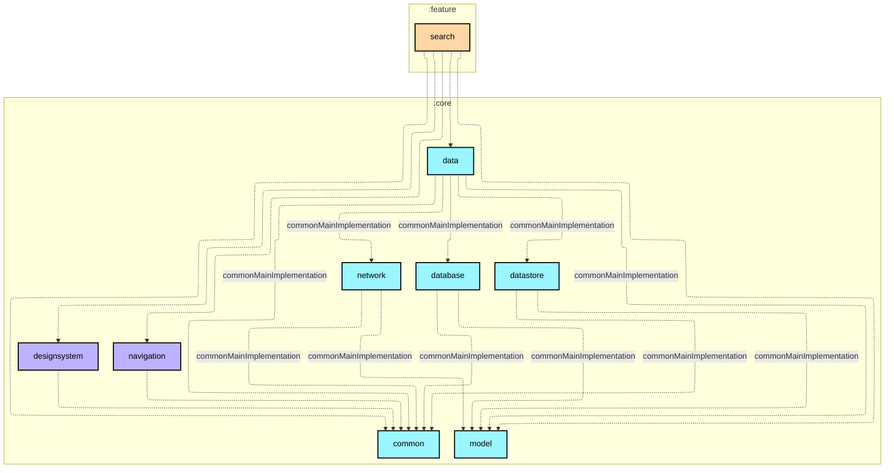

# `:feature:search`

## 🎯 模块职责
提供搜索与探索 UI；通过 `:core:data` 消费数据，不直接访问网络或数据库。

## 🏛️ 依赖关系
* **依赖的上游**：feature convention plugin 提供的 `:core:*` 依赖与 Navigation 3
* **被谁依赖**：`:app`
* **禁止依赖**：任何其他 `:feature:*` 模块

## ⚠️ 架构红线与约束
1. 不依赖任何其他 feature。
2. 导航意图经回调交由 `:app` 聚合；模块不持有全局导航容器。
3. ViewModel 必须由导航 entry 获取，保持 entry 级作用域。

## Module dependency graph

<!--region graph-->


<details><summary>📋 Graph legend</summary>

```mermaid
graph TB
  application[application]:::android-application
  feature[feature]:::android-feature
  kmp library[kmp library]:::kmp-library
  android library[android library]:::android-library

  application -.-> feature
  library --> kmp library

classDef android-application fill:#CAFFBF,stroke:#000,stroke-width:2px,color:#000;
classDef android-feature fill:#FFD6A5,stroke:#000,stroke-width:2px,color:#000;
classDef kmp-library fill:#9BF6FF,stroke:#000,stroke-width:2px,color:#000;
classDef android-library fill:#BDB2FF,stroke:#000,stroke-width:2px,color:#000;
classDef unknown fill:#FFADAD,stroke:#000,stroke-width:2px,color:#000;
```

</details>
<!--endregion-->
