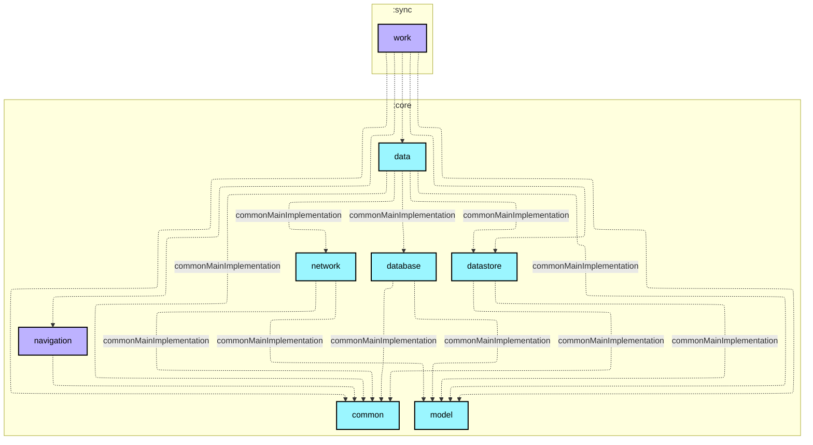

# :sync:work

## 职责与范围 (Scope & Responsibilities)
- 封装 Android Jetpack WorkManager 系统级后台同步与调度实现（对标 *Now in Android* `:sync:work`）；
- 调度 `BgmSyncWorker` 定期静默同步 Bangumi 每日放送日历，并发起 `bangumi-data` 静态资源的 ETag 304 探测；
- 提供 `WorkManagerSyncManager` 实现，向展现层暴露响应式 `isSyncing` 状态流与 `requestSync()` 即时触发能力；
- 整合 Koin WorkManager 依赖注入。

## 依赖拓扑 (Dependency Topology)
- 依赖 `:core:common`, `:core:data`, `:core:datastore`, `:core:network`, `:core:database`；
- 依赖 `androidx.work:work-runtime-ktx` 与 `koin-androidx-workmanager`；
- 被 `:app` 依赖以在启动阶段初始化系统调度。

## 架构红线 (Invariants)
1. **Worker 绝不直接操作底层网络与裸数据库**：所有数据同步操作必须委托给 `:core:data` 中的仓储接口（如 `ScheduleRepository`）；
2. **遵守系统约束**：周期性任务必须附加 `NetworkType.CONNECTED` 与 `RequiresBatteryNotLow` 等环境约束，严禁无网络时唤醒空转。

## Module dependency graph

<!--region graph-->


<details><summary>📋 Graph legend</summary>

```mermaid
graph TB
  application[application]:::android-application
  feature[feature]:::android-feature
  kmp library[kmp library]:::kmp-library
  android library[android library]:::android-library

  application -.-> feature
  library --> kmp library

classDef android-application fill:#CAFFBF,stroke:#000,stroke-width:2px,color:#000;
classDef android-feature fill:#FFD6A5,stroke:#000,stroke-width:2px,color:#000;
classDef kmp-library fill:#9BF6FF,stroke:#000,stroke-width:2px,color:#000;
classDef android-library fill:#BDB2FF,stroke:#000,stroke-width:2px,color:#000;
classDef unknown fill:#FFADAD,stroke:#000,stroke-width:2px,color:#000;
```

</details>
<!--endregion-->
